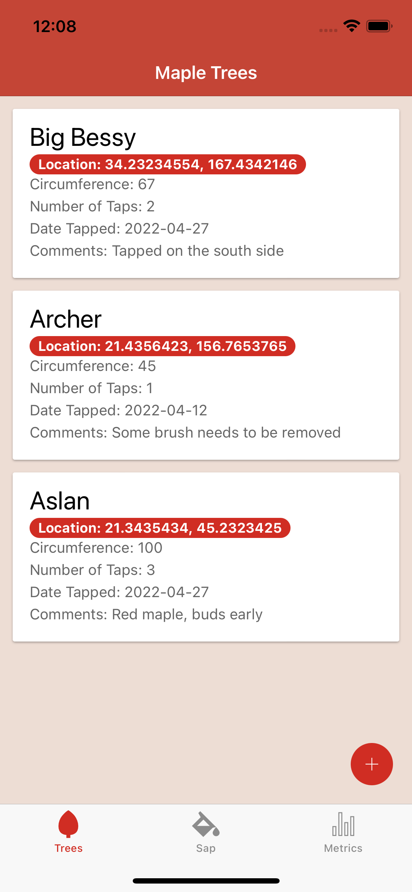
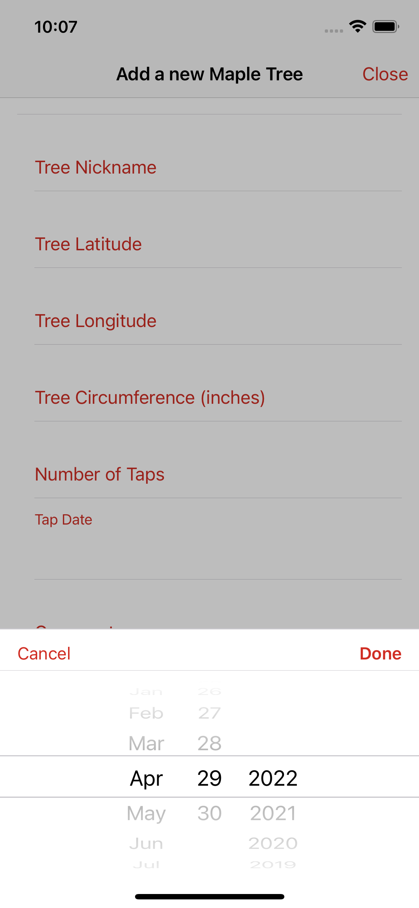
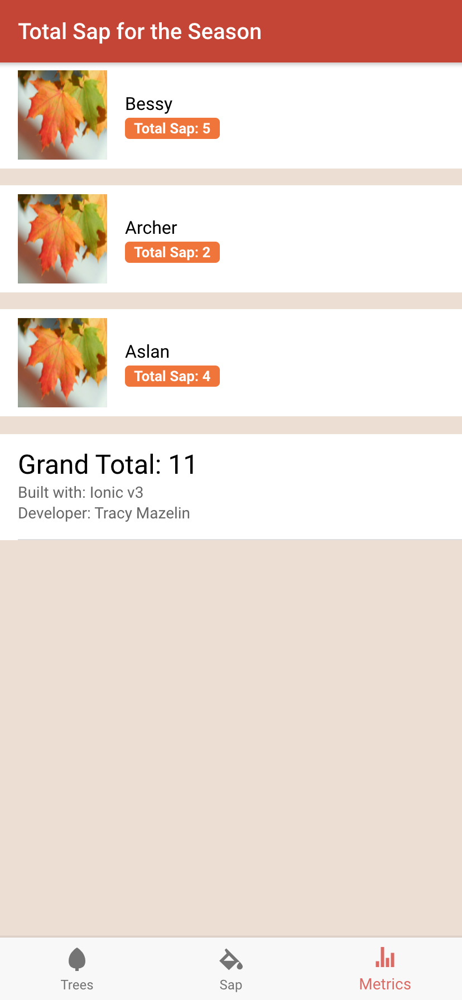

# My Maples
An Ionic 3 hybrid mobile application for Android and iOS using the Ionic storage module for indexeddb/sqlite and the Ionic Cordova Geolocation plugin for storing tree longitude and latitude data.  

This application is for maple syrup hobbyists who have numerous maple trees on their property and want to store the maple tree geo-locations, the sap production for each tree and keep track of metrics for how much sap each tree has produced in a season.

#### Created by: Tracy Mazelin ####

# Main features: #

- Add maple trees
    - Detect tree longitude and latitude via the ionic native GPS module
    - Add tree circumference
    - Calculate the number of taps the tree can support based on the circumference
    - Add tap date
    - Add comments about the tree
    - Give the tree a nickname for easy identification
    - Edit tree details
    - Delete trees
- Add sap quantity by tree
    - Add date the sap was collected
    - Add quantity the tree produced
- Metrics
    - View total sap produced by tree
    - View total sap produced for all trees for the season

# Installation

    $ git clone https://github.com/tracymazelin/MyMaples
    $ cd my-maples
    $ npm i
    $ ionic serve
 
# Screenshots

| Tree tab: list of trees                                    | Add tree modal                                                       |          
|------------------------------------------------------------|----------------------------------------------------------------------|
|         |                                     

| Tree tab: zero state                                       | Metrics tab: zero state                                              |          
|------------------------------------------------------------|----------------------------------------------------------------------|
|    |            |

| Add tree modal: geo loaction loading                       | Trees tab: action sheet                                              |  
|------------------------------------------------------------|----------------------------------------------------------------------|
|  |                               | 

| Add tree modal: date selector                              | Metrics tab: zero state                                              |  
|------------------------------------------------------------|----------------------------------------------------------------------|
|         |                                     

| Add sap tab: sap added toaster                             | Metrics tab: sap collection summaries                                |  
|------------------------------------------------------------|----------------------------------------------------------------------|
|       |                                      |
